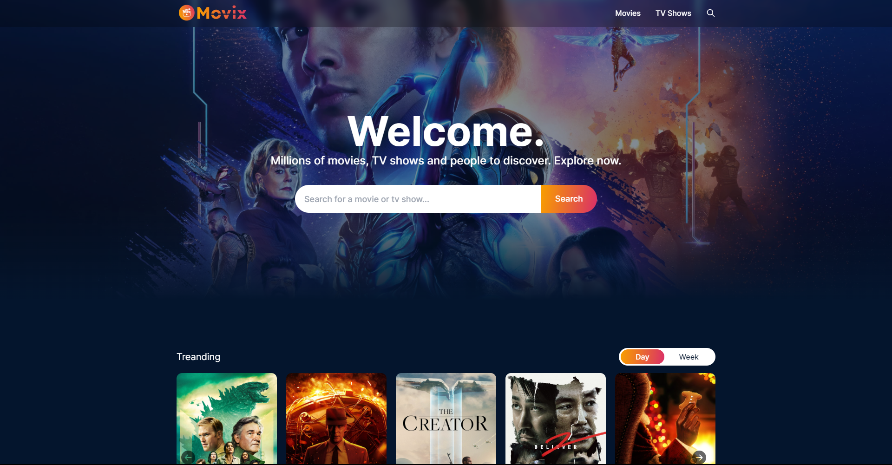
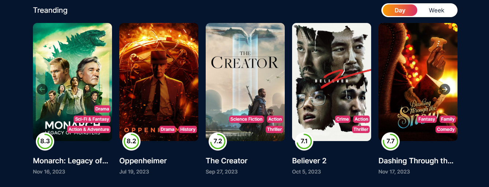
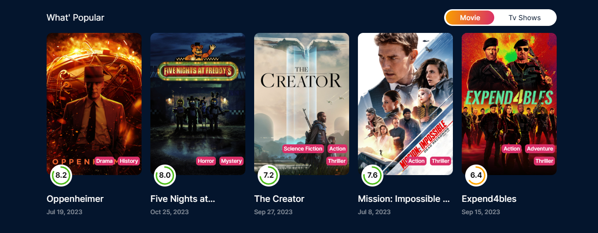
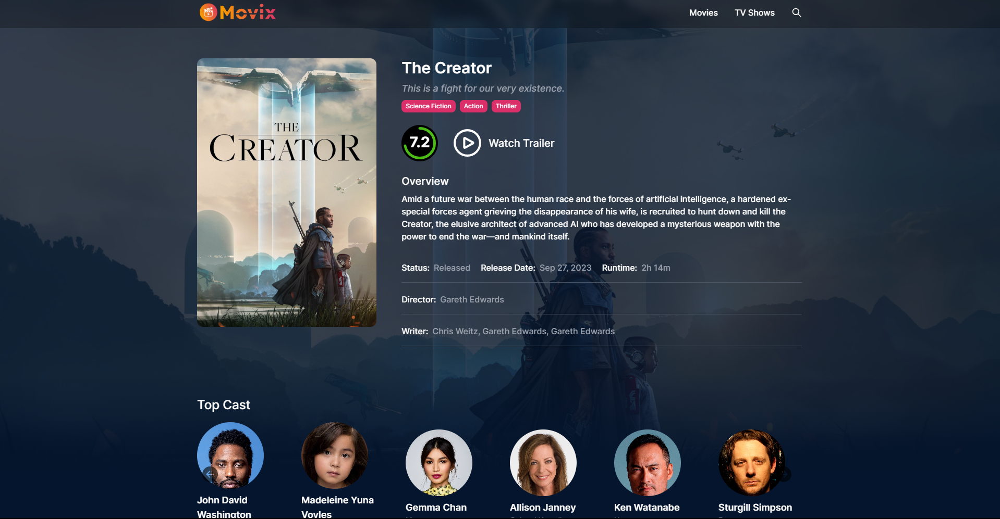
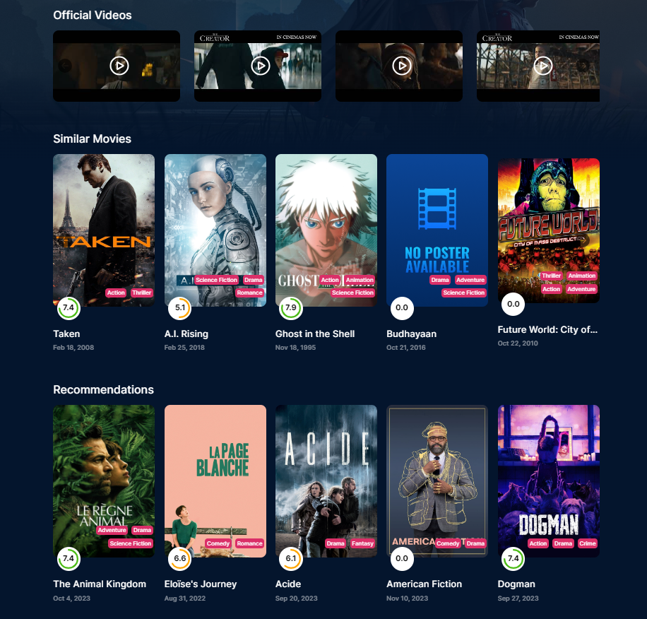
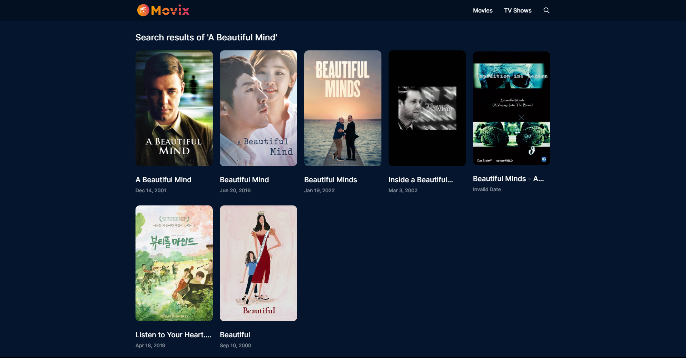
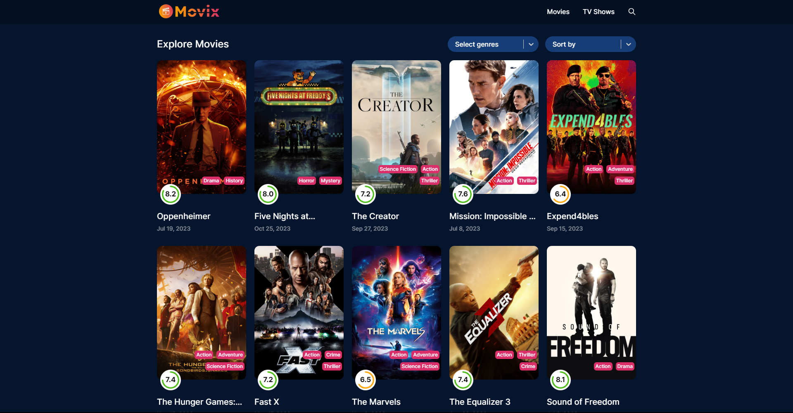
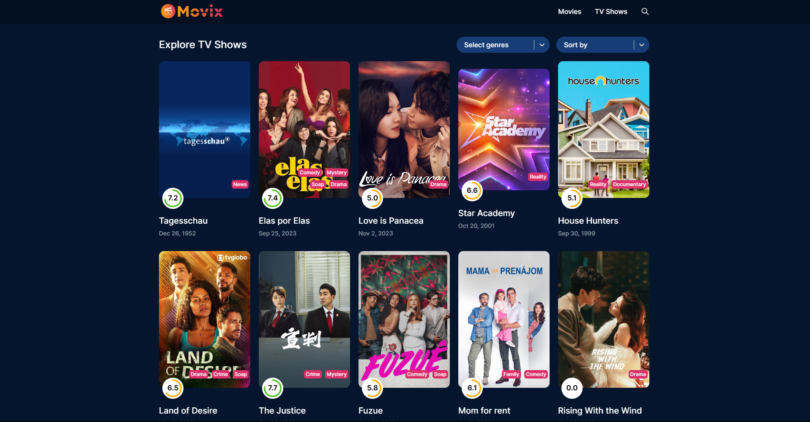

<h2 align="center">
Movie Galaxy App</h2>

<p align="center"></p>

<p>Movie Galaxy App is a web application built using React and React-query that allows users to search for movies and TV shows, view popular, trending, and upcoming releases on a daily and weekly basis, and explore detailed information about each title, including trailers and related videos.</p>

## Tech Stack


&nbsp;&nbsp;
&nbsp;&nbsp;
&nbsp;&nbsp;
&nbsp;&nbsp;

<h3>📝 Features</h3>

- <strong>Movie and TV Shows Search</strong>: Users can easily search for movies and TV shows by their respective names.

- <strong>Popular, Trending, and Upcoming:</strong> The homepage showcases popular, trending, and upcoming movies and TV shows, with their names, posters, genres, and ratings.

- <strong>Detailed Movie/TV Show Pages</strong>: Clicking on a movie or TV show provides users with a detailed page containing comprehensive information about the title, cast, runtime, release year, rating, director, writer, including its description, trailer, and additional videos.

- <strong>Personalized Recommendations</strong>: Users receive recommendations for similar movies and TV shows based on the content they are currently viewing.

- <strong>Fine-Tuned Filters</strong>: Users can apply filters based on various criteria, such as genre, release date, rating, and more, to refine their search results.

## [`🚀 Live Demo`](https://movie-galaxy-react.vercel.app/)

<h5>Tending & Popular Movies:</h5>




<h5>Movie Details Page:</h5>




<h5>Search Results Page:</h5>



<h5>Explore Movies & TV Shows:</h5>




<h3>🛠️ Installation Steps:</h3>

<p>1. Clone the repository</p>

```
git clone https://github.com/harun-rucse/movie-galaxy-react.git
```

<p>2. Install the required dependencies </p>

```
npm install
```

<p>3. Start the development server</p>

```
npm run dev
```

<p>4. Access the application at</p>

```
http://localhost:3000
```
